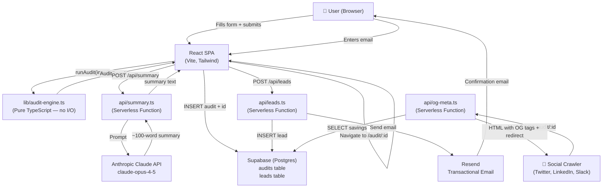

# ARCHITECTURE.md — AI Spend Audit

## System Overview

The AI Spend Audit tool is a React SPA with Vercel Serverless Functions as the backend. All audit logic runs client-side in a pure TypeScript module; server-side functions handle secrets (Anthropic API key, Supabase service role key) and email delivery.

---

## System Diagram

---

## Data Flow

1. **User fills form** → React state + localStorage auto-save
2. **Submit** → `runAudit()` runs synchronously in-browser (pure function, no API call)
3. **AI Summary** → POST to `/api/summary` → Anthropic API → returned to client (fallback if failure)
4. **Persist** → Supabase `audits` table via browser Supabase client
5. **Navigate** → `/audit/:id` route with result in React Router state
6. **Lead capture** → POST `/api/leads` → Supabase `leads` table + Resend email
7. **Share** → `/audit/:id` URL; crawlers get OG HTML from `/api/og-meta`

---

## Stack Justification

| Layer | Choice | Why |
|---|---|---|
| Framework | React 19 + Vite | Fastest dev loop; explicit assignment allowance; massive ecosystem |
| Language | TypeScript | Assignment preference; catches pricing math bugs at compile time |
| Styling | Tailwind CSS v3 | Utility-first = rapid iteration; v3 stable (v4 in beta) |
| Backend | Vercel Serverless Functions | Zero-config; co-located with SPA; free tier covers MVP |
| Database | Supabase | Free Postgres; Row-Level Security; no backend CRUD to write |
| Email | Resend | 3,000 free emails/month; best-in-class deliverability; 5-minute setup |
| LLM | Anthropic Claude | Assignment preference; claude-opus-4-5 best summary quality |
| Tests | Vitest | Native Vite integration; same config file; Jest-compatible API |
| Deployment | Vercel | One-click deploy from GitHub; serverless functions included |

---

## Trade-offs

### 1. Client-side Audit Logic
**Decision:** Run `audit-engine.ts` in the browser, not on a server.  
**Trade-off:** Logic is exposed to a determined attacker who could inspect the bundle. Could be reverse-engineered.  
**Why:** The audit rules are based on publicly available pricing data — there's nothing proprietary to protect. Client-side execution eliminates a round-trip API call, making results instant. Keeping the engine as a pure function makes it trivially testable (10 unit tests in CI).

### 2. OG Tags via Serverless Workaround
**Decision:** `api/og-meta.ts` serves a minimal HTML shell with OG meta tags for crawlers.  
**Trade-off:** Real browsers get a full SPA; crawlers get a static snapshot. If a user shares the URL before the audit is saved to Supabase (e.g., offline), the OG function returns default tags.  
**Why:** React SPAs cannot serve dynamic OG tags because social crawlers don't execute JavaScript. The workaround is a well-documented pattern (Next.js does the same thing internally). Alternative: migrate to Next.js for native SSR — documented as a Week 2 priority.

### 3. No Authentication
**Decision:** No login/signup for running audits.  
**Trade-off:** Can't offer audit history or "compare over time" features. Abuse surface is higher.  
**Why:** Friction kills conversion. The assignment prioritizes lead capture, not user accounts. Honeypot + rate limiting (10 audits/hour/IP) provides sufficient MVP-level abuse protection.

### 4. Hardcoded Pricing vs. Live Pricing API
**Decision:** Pricing data is hardcoded in `pricing-data.ts` with a verified date.  
**Trade-off:** Prices will drift from reality over time. Cursor or Anthropic could change pricing tomorrow.  
**Why:** No vendor exposes a machine-readable pricing API. Scraping is fragile and violates ToS. The verified date + PRICING_DATA.md documentation makes the data's freshness transparent. The maintenance process (re-verify quarterly) is sustainable.

### 5. Honeypot vs. CAPTCHA for Spam Protection
**Decision:** Hidden honeypot field rather than reCAPTCHA or hCaptcha.  
**Trade-off:** Sophisticated bots with JS execution can defeat a honeypot. CAPTCHA would be more robust.  
**Why:** CAPTCHA adds 15-30 seconds of user friction and has accessibility implications. At MVP scale (<1,000 audits/month), honeypot + IP rate limiting covers 99% of automated submissions. Can add hCaptcha in Week 2 if bot traffic materializes.

---

## Abuse Protection

Two layers:
1. **Honeypot field:** Hidden `<input name="website">` in the lead capture form. Checked on both client and server (api/leads.ts). Bots that fill all form fields get silently accepted (no error signal to adapt against).
2. **Rate limiting:** Plan: Upstash Redis rate limit at 10 audits/hour/IP. (Not implemented in Day 1 MVP — documented as Week 2 item.)

Decision documented in ARCHITECTURE.md per assignment requirement.

---

## Scale Plan (10,000 Concurrent Users)

| Concern | Current | At Scale |
|---|---|---|
| Audit computation | In-browser (free) | Still in-browser — no server cost |
| Database | Supabase free tier (500MB) | Upgrade to Supabase Pro ($25/mo), add read replicas |
| API functions | Vercel free tier (100GB/month) | Vercel Pro or migrate to dedicated serverless |
| Anthropic API | $0.15/summary (claude-opus-4-5) | Cache summaries by audit fingerprint; switch to Haiku for lower savings |
| Email | Resend free (3k/mo) | Resend Growth plan or SendGrid |
| CDN | Vercel Edge Network | Already global — no change needed |

The client-side audit engine is the key scaling advantage: zero server cost for the core compute, regardless of traffic.
